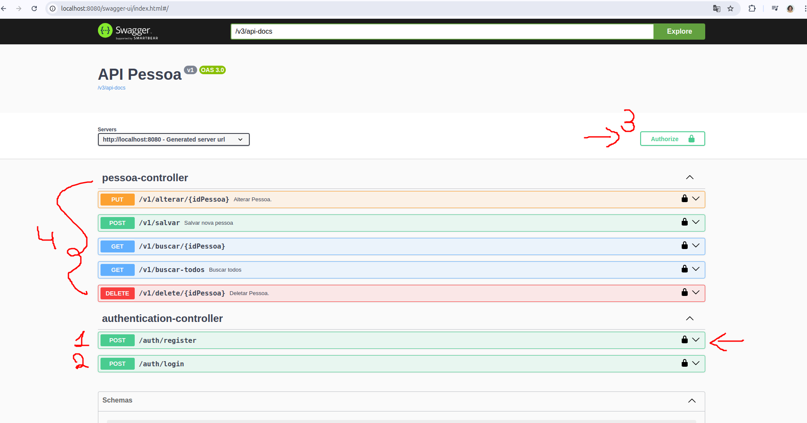

# PROJETO BASE PARA CRIAÇÃO ARQUITETURA HEXAGONAL COM JAVA 23 E SPRING 3.4.5

Esse projeto tem a finalidade de ser exemplo para criação de um novo projeto.

Tecnologias utilizadas.

* Java 23
* Spring data
* Spring security
* Spring feing
* Spring web
* Spring Cloud (openFeing)
* Auth0
* JWT
* Migrations FYWAYDB
* Mapstruct
* Swagger
* Banco h2

Para executar a aplicação e preciso startar a classe Application.java dentro do modulo interface.
Após subir o sistema.

A aplicação utilizar autenticação com Spring security, auth0 e JWT.
Sendo assim para se autenticar você precisa se registrar e logar.
Após o login você recebe um token que precisa colocar na autenticação do swagger
para poder utilizar os serviço
Segue imagem abaixo:

A aplicação já cria um usuário admin dentro da migrations
login admin, senha admin123

Existe a possíbilidade de criar com menor previlegios (user) pela aplicação.

[Acesso a url: http://localhost:8080/swagger-ui/index.html](http://localhost:8080/swagger-ui/index.html)

